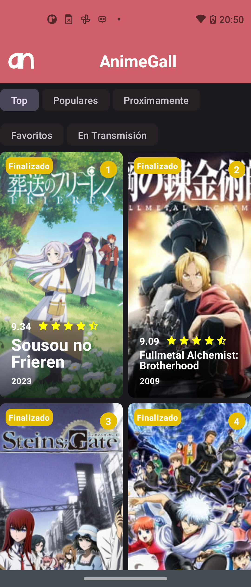
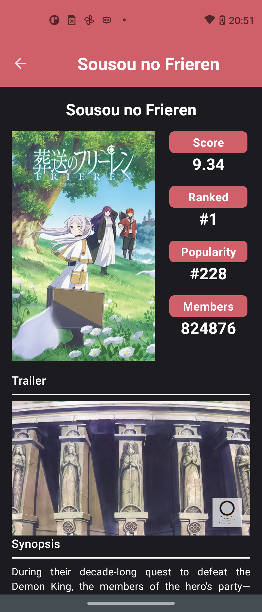
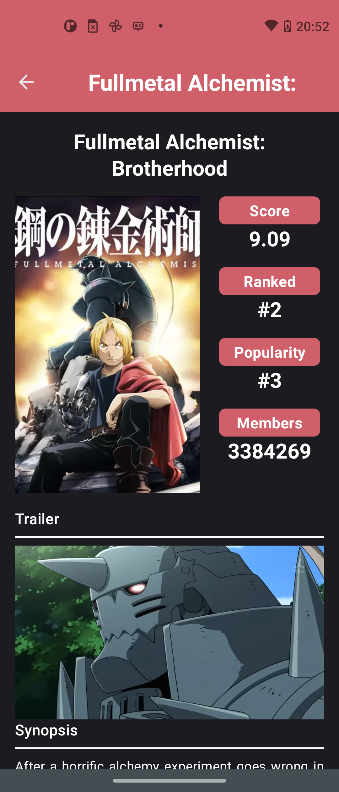
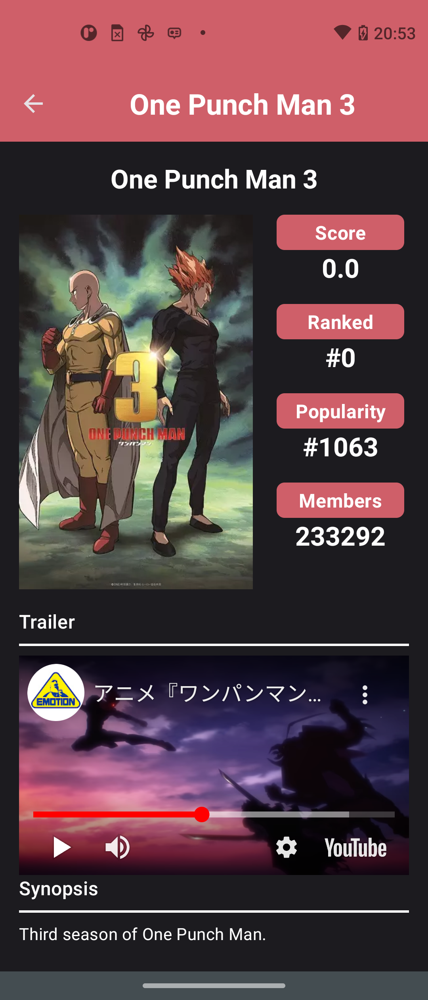

## Anime Gall
**Anime Gall** es una aplicación que consume la api de [Jikan API](https://jikan.moe/) y muestra una lista de animes, filtra la lista en varias categorias y ver detalles.

### Funcionalidades
* **Mostrar una lista de animes:**
    * Filtrar por Top, Populares, Proximamente, Favoritos, En Transmisión
    * Mostrar datos Status, Ranking, Valoracion, Nombre y año.
    * Al seleccionar un anime redirigir a detalles.
* **Mostrar detalles del anime seleccionado:**
    * Mostrar imagen.
    * Mostrar detalles como Score, Ranked, Popularity y Members.
    * Mostrar video de Trailer.
    * Mostrar Synopsis.

### Capturas de pantalla
**Lista**

**Detalles 1**

**Detalles 2**

**Detalles 3**
